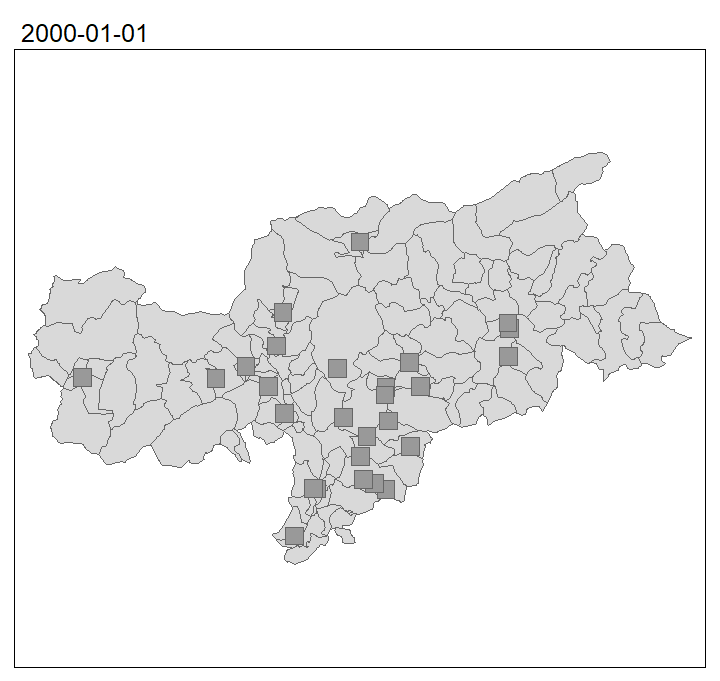

# A little collection of funtions to get data from the tables exported from the iffi-database

The package (without the vignettes) can be installed with:

`remotes::install_github("https://github.com/RobinKohrs/iffitoR")`

The problem with the vignettes is, that 

## A simple vignette with some descriptions

[Vignettes](https://robinkohrs.github.io/iffitoR/docs/index.html)

***

{width=50%}

