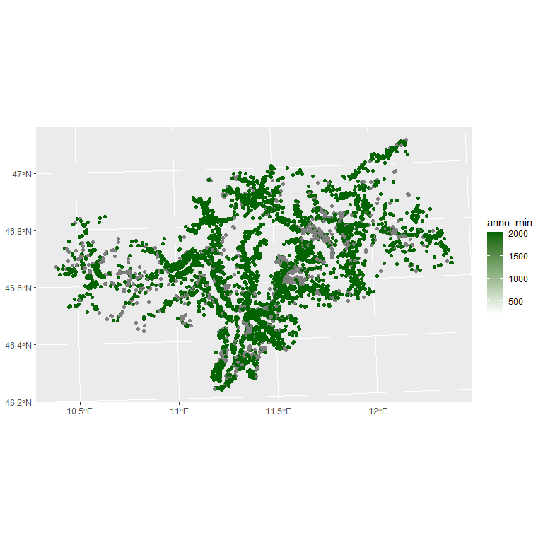

```{r, include = FALSE}
knitr::opts_chunk$set(
  collapse = TRUE,
  comment = "#>"
)
```

- first load some necessary packages

```{r setup, results='hide', message=FALSE, warning=FALSE}
library(iffitoR)
library(RODBC)
library(dplyr)
library(tools)
library(stringr)
library(sf)
```


- The idea is, that there are three important files
  
  + **A shapefile** (either of the points or polygons containing a colum called `PIFF_ID`)
  + **A database where the observations are single movements**  (*attribute database*)
  + **A database with additional information** (*dictionary database*)

- In the `attri`-argument we pass a vector of the colums that are already in the *attribute_database* and don't need any join to the dictionary database

- In the ``joins`-argument we pass a named list of hardcoded columns that are necessaey for the link and the data we actually want. The names are the `"<name_of_attributedatabase>.<table>.<column_to_link>"` and the values are `c("<name_of_dictionary_database>.<table><column_to_link>", "<name_of_dictionary_database>.<table><column_of_data_we_want")`

- An example could look like this: 

```{r}
joins = list(
    "tbl_frane.Geologia.litologia" = c(
      "diz_frane.diz_litologie.litologia",
      "diz_frane.diz_litologie.nome_litologia"
    ),
    
    "tbl_frane.clas_ii_liv.movimento" = c(
      "diz_frane.diz_movimenti.movimento",
      "diz_frane.diz_movimenti.nome_movimento"
    ))
```


- We only need to have the right paths at hand and the function `make_shapefile` will (hopefully) return an object of type `sf`

- Important: The names of the databases are the names without any extension

- Now we can call the function


```{r}

# Not run

#res_sf = make_shapefile(database_dir = "vignettes/data/",
#                       attribute_database_name = "test",
#                       dictionary_database_name = "dic_db",
#                       shape = "vignettes/data/IFFI10_1.shp",
#                       attri=c("anno_min", "mese_min"))
```

```{r, fig.width=8, fig.height=8}

# Not run

#library(ggplot2)
#res_sf = res_sf %>% filter(anno_min > 2000)
#
#res_gg = ggplot(res_sf) +
#  geom_sf(aes(color=anno_min)) +
#  scale_color_continuous(low="white", high="darkgreen", na.value="grey", name="year")
#
#res_gg
``` 


```{r, echo=F, fig.align='center', out.width="80%", out.height="80%"}

```

